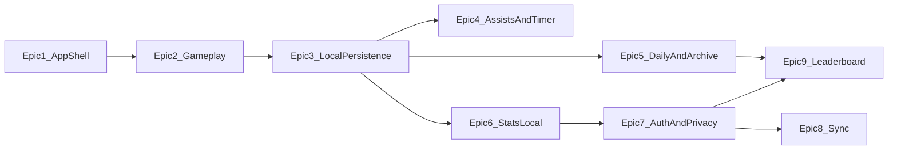

### Sudoku v1 — Epics (Milestone Delivery Breakdown)

## Purpose

This document breaks Sudoku v1 into **shippable epics (milestones)**. Each epic defines:

- **In scope**: what we will deliver in that epic
- **Out of scope**: explicitly not included (or deferred)
- **Dependencies**: prerequisites and prior epics
- **Acceptance (high level)**: what “done” looks like (not a full WBD)

## Sources of truth (v1)

- PRD: `docs/sudoku-prd-v1.md`
- Screens & menus: `docs/sudoku-screens-and-menus-v1.md`
- Settings inventory: `docs/sudoku-settings-v1.md`
- Master stack: `docs/sudoku-master-stack-v1.md`
- UI/UX (Figma Make): `https://www.figma.com/make/BXuIw8tGSZMaJcMeF439WT/Dark-Themed-Sudoku-UI-UX?t=Cn2IvBm76IroVvni-1`

## UI/UX source-of-truth policy (Figma Make)

- **Figma Make is the UI/UX source of truth** for visuals and interaction intent.
- **PRD/screen/settings docs are the source of truth** for functionality, rules, and what must exist.
- We do **not** treat Figma output as a drop-in runtime dependency; we implement using RN primitives and extracted tokens/patterns (see `docs/sudoku-master-stack-v1.md`).

### If Figma is missing elements/features/functionality

We must **flag it** rather than inventing UI/UX:

- Create a short “Design gap” note in the relevant epic’s WBD (later) describing what’s missing and what decision is needed.
- If the gap blocks implementation, treat it as **blocked** until resolved in Figma (or explicitly approved as a product decision).
- If the gap is non-blocking, implement only what is specified in PRD/docs and keep the UI minimal, while still flagging the missing Figma design for follow-up.

## Epic map (high level)

- Epic 1: App shell + scaffolding validation (folded)
- Epic 2: Classic Sudoku engine + core gameplay loop
- Epic 3: Offline persistence + autosave/resume + “3 in-progress” policy
- Epic 4: Assists + hints/checking + timer/pause/board hiding
- Epic 5: Daily + archive (offline deterministic daily)
- Epic 6: Stats/history + profile UX (local-first)
- Epic 7: Accounts/auth (optional) + privacy/data controls (MVP)
- Epic 8: Sync (settings + progress + stats) + conflict policy
- Epic 9: Daily leaderboard + Competitive Daily + submission validation

## Dependencies (milestone ordering)

---

## Epic 1 — App shell + scaffolding validation (folded)

### Objective

Provide a stable, navigable app shell and validate the existing scaffolding so we can build features as vertical slices.

### In scope

- **Navigation shell** aligned to v1:
  - Home, Play, Leaderboard, Settings/Profile routes (even if some are placeholders initially)
  - Basic “not found” / error-safe routing
- **Baseline UI foundation**:
  - Theme support hook-up (System/Light/Dark) and token usage approach
  - Shared primitives (buttons/text) as needed for consistent UI
- **Non-gameplay settings foundations** (from settings inventory):
  - Sound on/off and haptics on/off
  - Text size override (bounded options)
- **Placeholders required by PRD/screens**:
  - “Coming soon!” placeholder for non-classic game types (non-interactive)
- **Scaffolding validation** (since scaffolding has started):
  - App starts on web + at least one native target
  - Tests/lint run successfully (baseline)
  - Crash reporting baseline enabled (provider choice per master stack; details deferred)

### Out of scope

- Any complete gameplay implementation (grid, solver, puzzle generation)
- Auth, sync, leaderboards, stats (beyond placeholder screens)

### Dependencies / prerequisites

- Existing repo scaffolding in `apps/sudoku/**`

### Acceptance (high level)

- Can navigate between Home/Play/Leaderboard/Settings without crashes
- Placeholders clearly indicate what is not yet implemented
- Local dev commands work for the app (start + tests + lint)

---

## Epic 2 — Classic Sudoku engine + core gameplay loop

### Objective

Deliver a playable, high-quality **classic 9x9** Sudoku experience (Free Play) with fast input and reliable correctness.

### In scope

- **Sudoku engine (pure TS)**:
  - Generator capable of producing **unique-solution** puzzles
  - Solver/validator logic
  - Solver-based difficulty rating (not just clue count)
  - Difficulty bands: Easy/Medium/Hard/Expert/Master/Extreme
  - Puzzle quality requirements (PRD): clue-count ranges enforced per difficulty and symmetry preference (best-effort)
- **Play modes**:
  - Free Play (fixed difficulty selection)
  - Adaptive mode entry + basic “current band/rating” surfaced (algorithm details refined later)
- **Core gameplay screen** (`Game`):
  - Grid rendering (prefilled vs user-entered)
  - Cell selection model
  - Numpad (digits 1–9, erase)
  - Input rules for editing (cannot overwrite prefills)
  - Completion detection (filled + matches solution)
- **Web keyboard support (baseline)** (per PRD):
  - Digits 1–9 to enter, delete/backspace to clear
  - Arrow keys move selection
  - (Exact shortcut mapping can be refined later; this epic establishes the base)

### Out of scope

- Autosave/resume durability (Epic 3)
- Notes, undo/redo, hints/checking, conflict highlighting, error-prevention modes (Epic 4)
- Daily puzzle identity/archive (Epic 5)
- Stats/history aggregation and visualizations (Epic 6)

### Dependencies / prerequisites

- Epic 1 navigation shell and UI primitives

### Acceptance (high level)

- Player can start a Free Play puzzle, enter values, and complete it
- Engine guarantees unique solutions and difficulty constraints per PRD
- Keyboard + numpad input feels responsive (no visible input lag)

---

## Epic 3 — Offline persistence + autosave/resume + “3 in-progress” policy

### Objective

Make gameplay durable and offline-first: progress is always saved, restored, and constrained to v1’s in-progress limits.

### In scope

- **Autosave policy**: persist progress within ~1s of last action (PRD target)
- **Resume**: app restarts/crashes restore the latest autosave state
- **Up to 3 in-progress puzzles** total (including Daily if started)
- **Local storage design** (SQLite source of truth; settings KV as needed)
- **Continue module** on Home showing up to 3 in-progress puzzles

### Out of scope

- Cross-device sync (Epic 8)
- Leaderboard submission (Epic 9)

### Dependencies / prerequisites

- Epic 2 gameplay state model that can be serialized/deserialized

### Acceptance (high level)

- Kill/restart the app and the current puzzle state returns correctly
- Attempting to start a 4th in-progress puzzle is blocked by policy/UI
- Offline play works end-to-end for Free Play (no network required)

---

## Epic 4 — Assists + hints/checking + timer/pause/board hiding

### Objective

Deliver the v1 assist features, timer behavior, and pause privacy requirements.

### In scope

- **Assists** (as defined in PRD/settings):
  - Notes/pencil marks
  - Undo/redo
  - Highlighting: row/column/box and same-number highlighting (including selecting prefills)
  - Conflict highlighting (duplicates display)
  - Error prevention modes: duplicates-only and strict-vs-solution
  - Auto-remove notes and auto candidates
- **Hints & checking**:
  - Hints enabled + hint types as configured
  - Check solution / validate actions
- **Timer + pause**:
  - Toggleable timer
  - Zen mode
  - Lives (0–10 or Infinity) behavior
  - Manual pause
  - Auto-pause on background/tab hidden
  - Auto-pause on idle + idle timeout setting
  - **Board hiding** while paused/backgrounded (privacy/anti-cheat-lite)
- **Input + board sizing settings** (from settings inventory):
  - Notes input behavior (toggle vs long-press)
  - Auto-advance after keyboard entry
  - Left-handed mode (numpad placement)
  - Board sizing sliders (grid size, input number size, notes size) with preview
- **Numpad behavior enhancements**:
  - Digit lock toggle behavior
  - Disable numpad digits when all 9 placements are correct (prefilled + user)

### Out of scope

- Competitive Daily eligibility + leaderboard submission (Epic 9)
- Daily archive UX (Epic 5)

### Dependencies / prerequisites

- Epic 3 persistence model must capture assist/timer state needed for resume

### Acceptance (high level)

- Assists behave as described in PRD/settings and persist across resume
- Pausing/backgrounding hides the board quickly
- Numpad digit-lock and “digit completed” disabled states behave correctly

---

## Epic 5 — Daily + archive (offline deterministic daily)

### Objective

Ship the Daily puzzle experience that works offline and resets at local midnight, including a 30-day archive.

### In scope

- **Daily puzzle identity** by date key (local-midnight reset)
- **Deterministic daily generation** so everyone gets the same daily while offline
- **Daily archive**: last 30 days browse/play
- **Daily mode chooser**: Competitive vs Casual entry points (policy enforced later)

### Out of scope

- Daily leaderboard submissions (Epic 9)
- Strong anti-cheat (explicitly out of v1 per PRD)

### Dependencies / prerequisites

- Epic 2 engine/generator and Epic 3 persistence

### Acceptance (high level)

- Daily puzzle changes at local midnight and is consistent across devices (by date)
- Archive shows and loads the last 30 daily puzzles
- Daily can be played fully offline

---

## Epic 6 — Stats/history + profile UX (local-first)

### Objective

Provide a satisfying stats and history experience based on local play, with a profile surface for identity settings.

### In scope

- **Local stats tracking** aligned to PRD definitions:
  - Games played, wins, losses, win rate
  - Assisted vs unassisted counts
  - Daily streak (current, best)
  - By-difficulty stats (best time, average/median, etc.)
  - Daily results history (per day status + time + assisted/unassisted)
- **Stats UI**:
  - Overview screen
  - By-difficulty table
  - Daily history list/calendar style
  - Time distribution visualization (as defined in PRD; implementation details TBD later)
- **Profile landing UI** (local-first): display name/avatar customization (local persistence)
- **Favorites/bookmarks (local)**:
  - Favorite a puzzle (Daily or Free Play) and persist locally

### Out of scope

- Cloud-backed public profiles / social discovery (out of v1 per PRD)
- Cross-device sync (Epic 8)

### Dependencies / prerequisites

- Epic 3 persistence + Epic 4 assisted/unassisted tracking inputs

### Acceptance (high level)

- Stats screens populate deterministically from recorded play
- Daily streak increments on Daily completion as per PRD

---

## Epic 7 — Accounts/auth (optional) + privacy/data controls (MVP)

### Objective

Enable optional sign-in that unlocks sync/leaderboards and deliver required privacy controls.

### In scope

- **Auth methods** (per PRD):
  - Sign in with Apple
  - Sign in with Google
  - Email magic link
  - Sign out and basic re-auth flows
- **Account linking** support (recommended by PRD)
- **Profile edit** backed by account (display name/avatar)
- **Privacy & data controls UI** (MVP paths):
  - Analytics opt-out (where feasible)
  - Export my data (hook/flow; exact export format defined later)
  - Delete account + cloud data (flow + confirmations)
  - Clear local data (flow + confirmations)

### Out of scope

- Full sync implementation (Epic 8)
- Leaderboard implementation (Epic 9)

### Dependencies / prerequisites

- Epic 6 profile/stat surfaces to connect to auth state

### Acceptance (high level)

- User can sign in/out with the supported methods
- Privacy controls are present in-app and functional at an MVP level

---

## Epic 8 — Sync (settings + progress + stats) + conflict policy

### Objective

Deliver cross-device continuity: local-first play that syncs when online, with a clear conflict policy.

### In scope

- **Sync scope** per PRD:
  - Settings
  - In-progress puzzle state
  - History & stats
  - Favorites/bookmarks
- **Offline/online behavior**:
  - Local writes always succeed
  - Background sync with retries/backoff
  - Clear sync status and error states
- **Conflict strategy**: last write wins (with safe record design)

### Out of scope

- Strong anti-cheat or server-authoritative gameplay

### Dependencies / prerequisites

- Epic 7 auth
- Epic 3/6 stable local schemas for replication

### Acceptance (high level)

- Sign in on two devices and observe settings/progress/stats converge after reconnect
- Sync failures are surfaced and recoverable

---

## Epic 9 — Daily leaderboard + Competitive Daily + submission validation

### Objective

Deliver a fair Daily competition with leaderboards, eligibility enforcement, and server-side submission validation.

### In scope

- **Competitive Daily preset**:
  - Enforces the Competitive Daily settings requirements from PRD
  - Run becomes non-submittable when any assisted trigger occurs
  - In-game “eligibility lost” banner with a reason
- **Leaderboard UI** (today’s Daily only): rank, avatar/name, time, highlight self
- **Submission flow**:
  - Sign-in required
  - Eligible completion required
  - Clear success/failure states
- **Server-side validation (v1 “medium”)**:
  - Validate puzzle identity/date
  - Validate completion correctness (final grid matches solution)
  - Sanity check times
  - Stable error shapes (versionable)

### Out of scope

- Strong anti-cheat (server-authoritative timer/proofs)
- Archived leaderboards (PRD v1: today only)

### Dependencies / prerequisites

- Epic 5 Daily identity
- Epic 7 auth

### Acceptance (high level)

- Eligible Competitive Daily completions can submit and appear on today’s leaderboard
- Ineligible runs are clearly prevented from submitting and show why

---

## Explicitly out of scope for v1 (per PRD)

- Monetization
- Variants / non-9x9 Sudoku sizes
- Notifications
- Strong anti-cheat (server-authoritative play)
- Friends / social features
- Public profiles and broad user discovery

